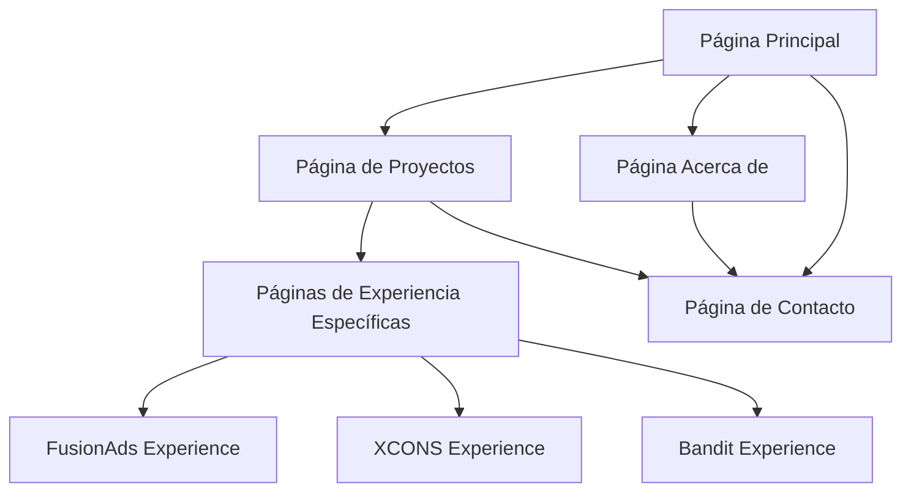

# Documento de Requerimientos del Producto - Portfolio Personal

## 1. Resumen del Producto

Portfolio personal moderno desarrollado con React 18, TypeScript y Vite que presenta las habilidades profesionales, experiencias laborales y proyectos destacados de un desarrollador Full Stack. El sitio web cuenta con animaciones avanzadas, internacionalización (i18n) y un diseño responsivo con estética Fluent Design inspirada en Windows 11.

* **Propósito principal**: Mostrar experiencia profesional, habilidades técnicas y proyectos realizados para potenciales empleadores y clientes.

* **Usuarios objetivo**: Reclutadores, empleadores potenciales, clientes y colegas del sector tecnológico.

* **Valor del producto**: Diferenciación profesional a través de una presentación visual moderna y técnicamente avanzada.

## 2. Características Principales

### 2.1 Roles de Usuario

| Rol       | Método de Acceso            | Permisos Principales                                       |
| --------- | --------------------------- | ---------------------------------------------------------- |
| Visitante | Acceso directo sin registro | Navegar por todas las secciones, cambiar idioma, contactar |

### 2.2 Módulos de Funcionalidad

Nuestro portfolio consta de las siguientes páginas principales:

1. **Página Principal**: sección hero con animaciones, navegación principal, selector de idioma, información personal.
2. **Página de Proyectos**: galería de proyectos destacados, detalles técnicos, experiencias laborales específicas.
3. **Página Acerca de**: biografía profesional, habilidades técnicas, testimonios.
4. **Página de Contacto**: formulario de contacto, información de contacto, integración con servicios externos.
5. **Páginas de Experiencia**: páginas específicas para FusionAds, XCONS y otros proyectos destacados.

### 2.3 Detalles de Páginas

| Nombre de Página       | Nombre del Módulo        | Descripción de Funcionalidad                                                          |
| ---------------------- | ------------------------ | ------------------------------------------------------------------------------------- |
| Página Principal       | Sección Hero             | Mostrar animación de bienvenida, título morfológico multiidioma, navegación principal |
| Página Principal       | Selector de Idioma       | Alternar entre español e inglés, persistir preferencia del usuario                    |
| Página Principal       | Navegación               | Menú hamburguesa responsivo, navegación fluida entre secciones                        |
| Página de Proyectos    | Galería de Proyectos     | Mostrar proyectos en formato masonry, filtros por categoría, modal de detalles        |
| Página de Proyectos    | Experiencias Laborales   | Mostrar roles, períodos, herramientas utilizadas, logros específicos                  |
| Página Acerca de       | Biografía                | Presentar información personal y profesional, timeline de carrera                     |
| Página Acerca de       | Habilidades Técnicas     | Slider de tecnologías, categorización por tipo (Frontend, Backend, Tools)             |
| Página de Contacto     | Formulario de Contacto   | Validación de campos, integración con EmailJS, confirmación de envío                  |
| Página de Contacto     | Información de Contacto  | Mostrar datos de contacto, enlaces a redes sociales                                   |
| Páginas de Experiencia | Detalles de Proyectos    | Mostrar capturas de pantalla, descripciones técnicas, tecnologías utilizadas          |
| Páginas de Experiencia | Componentes Interactivos | Elementos 3D con Spline, animaciones personalizadas                                   |

## 3. Proceso Principal

El flujo principal del usuario incluye la navegación desde la página de inicio hacia las diferentes secciones para conocer la experiencia profesional y finalmente establecer contacto.

**Flujo del Visitante:**

1. Acceso a la página principal
2. Exploración de proyectos y experiencias
3. Revisión de habilidades y biografía
4. Contacto a través del formulario

## 4. Diseño de Interfaz de Usuario

### 4.1 Estilo de Diseño

* **Colores primarios**: Esquema de colores oscuros con acentos en verde (#00ff88) y azul

* **Colores secundarios**: Grises para texto y fondos, blancos para contraste

* **Estilo de botones**: Botones con efecto glassmorphism, bordes redondeados, efectos hover suaves

* **Tipografía**: Morganite para títulos, NHaas Grotesk para texto general, tamaños responsivos

* **Estilo de layout**: Diseño basado en cards con efectos de transparencia, navegación superior fija

* **Iconos y emojis**: Iconos minimalistas, emojis contextuales para mejorar la experiencia visual

### 4.2 Resumen de Diseño de Páginas

| Nombre de Página    | Nombre del Módulo | Elementos de UI                                                                      |
| ------------------- | ----------------- | ------------------------------------------------------------------------------------ |
| Página Principal    | Sección Hero      | Fondo con overlay de grano, título animado con morphing, botón CTA con glassmorphism |
| Página Principal    | Navegación        | Menú hamburguesa con animación fluida, selector de idioma con banderas               |
| Página de Proyectos | Galería           | Layout masonry responsivo, cards con hover effects, modal overlay                    |
| Página Acerca de    | Biografía         | Timeline vertical con animaciones scroll-triggered, cards de información             |
| Página Acerca de    | Habilidades       | Slider horizontal con logos de tecnologías, badges categorizados                     |
| Página de           |              |                                                                                 |

